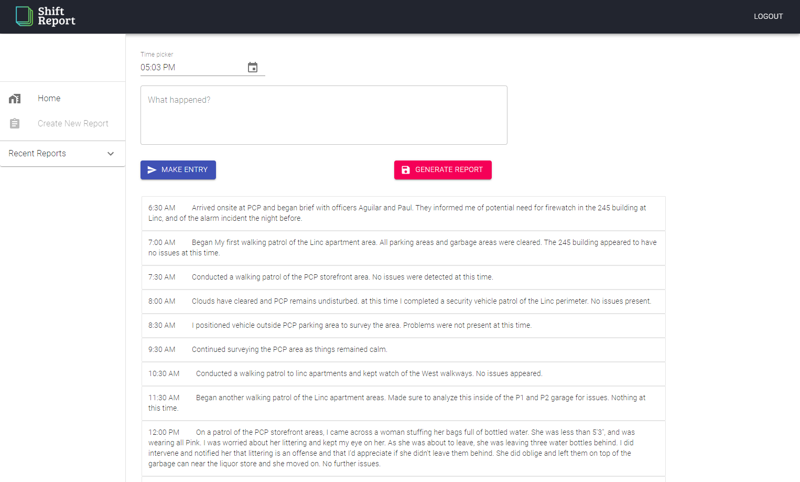

<h1 align="center"> Shift Report Generator </h1>  

#### Seemless Report Generation!

<!-- START doctoc generated TOC please keep comment here to allow auto update -->
<!-- DON'T EDIT THIS SECTION, INSTEAD RE-RUN doctoc TO UPDATE -->

## Table of Contents

- [Introduction](#introduction)
- [Hosting](#hosting)
- [Features](#features)
- [Technologies](#technologies)
- [Build](#build)
- [Bugs](#bugs)
- [Contact](#contact)

<!-- END doctoc generated TOC please keep comment here to allow auto update -->

## Introduction

_This a Rails API and React front end built to simply have a user log in with their security officer information, add entries on the events that occurred during their shift, and generate a docx file with those entries included. Great for security companies wanting to automate the report formatting process!_

**Desktop design focused**

<video width="320" height="240" controls>
  <source src="./public/Recording.mp4" type="video/mp4">
</video>

## Hosting

Shift Report is live! -> [Shift Report](https://stage1.dpa1hp3vejn1k.amplifyapp.com/)
Frontend hosted on AWS Amplify
Backend REST API hosted on Heroku

## Features

A few of the things you can do with the app:

- Register a user account with email
- Create a report
- Add entries to that report
- generate a docx file of that report with those entries

## Technologies

- JavaScript
- React.js
- ContextAPI
- MaterialUI
- VS Code
- Git and Github
- Ruby 2.5.6
- Rails 6
- PostgreSQL

## Build

#### To build on your own machine
##### Backend
- Clone or download the repo
- Navigate into that repo with `cd ruby_shift_report`
- `bundle` to install gems
- You will likely have to create a database with `rails db:create db:migrate`
- `rails s` to run the API on localhost
##### Frontend
- Navigate to the shift_report_frontend directory in /app/ then run `npm install`
- Then run `npm start` to run the frontend on localhost:3006
- Open your preffered browser and navigate to http://localhost:3006

## Bugs

If the automatic logout alert signals, and you open the app in another broser or tab, the application will be unable to start up

## Contact

If you'd like to inquire about any details, or have questions about the technology, feel free to contact me.

Email:

- jci@pdx.edu

### License

- _This software is licence under the MIT license._
